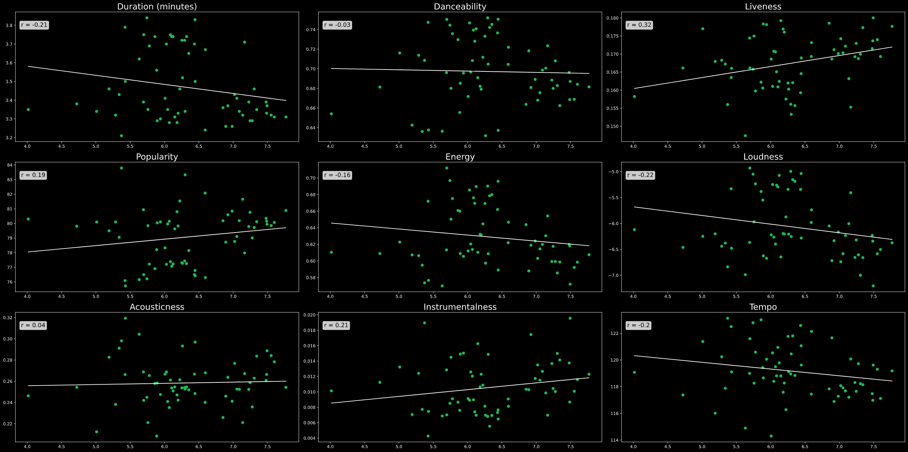

# SpotifySongAnalysisProject

## Summary
The goal of this project is to analyze the data available from Spotify to answer questions about Spotify Audio Features by song year, correlation between Audio Features and country metrics, and the Spotify Audio Features by song year. Technologies to be used are Python, Jupyter Notebooks, Pandas, Requests, and Matplotlib. Optionally, the Spotify API can be used but will match the Kaggle Data. For this we used the following data sources:

1. [Spotify Audio Features](https://www.kaggle.com/yamaerenay/spotify-dataset-19212020-160k-tracks)
2. [Spotify Charts](https://spotifycharts.com/regional)
3. [World Metrics](https://www.kaggle.com/unsdsn/world-happiness)
4. [2017 Musician Deaths](https://en.wikipedia.org/wiki/List_of_2017_deaths_in_rock_and_roll)

# Questions

## In 2019, do Audio Features of charting songs correlate to a country's Happiness Score?

* Use the Happiness Score from [World Metrics](https://www.kaggle.com/unsdsn/world-happiness), scrape the 2019 weekly data for each region from [Spotify Audio Features](https://www.kaggle.com/yamaerenay/spotify-dataset-19212020-160k-tracks), and use the Audio Features from here [Spotify Audio Features](https://www.kaggle.com/yamaerenay/spotify-dataset-19212020-160k-tracks).
* Merge the 3 data sets and aggregate each Audio Feature by the appropriate measure of central tendency.
* Show plots with regression lines and give the r value for each Audio Feature by Country Happiness Score.

## In 2019, do Audio Features of charting songs correlate to a country's Freedom to Make Life Choices Score?

* Use the Freedom to Make Life Choices Score from [World Metrics](https://www.kaggle.com/unsdsn/world-happiness), scrape the 2019 weekly data for each region from [Spotify Audio Features](https://www.kaggle.com/yamaerenay/spotify-dataset-19212020-160k-tracks), and use the Audio Features from here [Spotify Audio Features](https://www.kaggle.com/yamaerenay/spotify-dataset-19212020-160k-tracks).
* Merge the 3 data sets and aggregate each Audio Feature by the appropriate measure of central tendency.
* Show plots with regression lines and give the r value for each Audio Feature by Freedom to Make Life Choices Score.

## In 2019, do Audio Features of charting songs correlate to a country's GDP per Capita?

* Use the GDP per Capita from [World Metrics](https://www.kaggle.com/unsdsn/world-happiness), scrape the 2019 weekly data for each region from [Spotify Audio Features](https://www.kaggle.com/yamaerenay/spotify-dataset-19212020-160k-tracks), and use the Audio Features from here [Spotify Audio Features](https://www.kaggle.com/yamaerenay/spotify-dataset-19212020-160k-tracks).
* Merge the 3 data sets and aggregate each Audio Feature by the appropriate measure of central tendency.
* Show plots with regression lines and give the r value for each Audio Feature by GDP per Capita.

## How have Audio Features changed over time?

* Use the Audio Features from here [Spotify Audio Features](https://www.kaggle.com/yamaerenay/spotify-dataset-19212020-160k-tracks).
* Determine the appropriate measure of central tendency for each Audio Feature and give evidence.
* Show plots displaying the change in each Audio Feature over time.

## In 2017, What is the Impact on Streams of Artists following their Deaths?

* Scrape the 2017 daily charts in the US from [Spotify Audio Features](https://www.kaggle.com/yamaerenay/spotify-dataset-19212020-160k-tracks) and use the deaths of these [artists](https://en.wikipedia.org/wiki/List_of_2017_deaths_in_rock_and_roll) to cross reference.
* Narrow the data frame to artists that hit the charts in 2017 and died in 2017.
* Compare the streams before death, on the day of death, and after death using line plots.

# How did we do it? (Spoilers)

## Scraping the data
* The work for this is done in [Daily 2017 US Charts](2017-daily-us-charts.ipynb) and [Weekly 2019 Charts by Region](2019-weekly-regional-charts.ipynb).
* This uses the requests library and Beautiful Soup to grab the html from [Spotify Charts](https://spotifycharts.com/regional) and converts the data into a large csv. We then open the csv as a data frame to analyze.

## How have Audio Features changed over time?

* The analysis for this question is in the [Features Over Time](metrics_over_time.ipynb) notebook.

* Valence – The average valence was the lowest in 1946, meaning this was the saddest year of music in our dataset. This is likely due to WWII.
*Acousticness – We noticed a general drop is acousticness over the decades, which makes sense considering the rise of digital music making
*Popularity – Considering “The popularity is calculated by algorithm and is based, in the most part, on the total number of plays the track has had and how recent those plays are”, this analysis confirmed our assumption that the more recent a song was made, the more popular it would be.

## In 2019, do Audio Features of charting songs correlate to a country's Happiness Score, Freedom to Make Life Choices Score, GDP per Capita?

* The analysis for this question is in the [Audio Features vs Country Metrics](CountryHappinessAnalysis.ipynb) notebook.
* @Connor - please write up some findings in this bullet format - 1 or 2 bullets for each metric  

## In 2017, What is the Impact on Streams of Artists following their Deaths?
* The analysis for this question is in the [2017 Artist Deaths](2017ArtistDeathAnalysis.ipynb) notebook.
* The deaths of Chester Bennington (Linkin Park) and Tom Petty had the most significant initial effect of on Spotify streams by a wide margin. Linkin Park and Tom Petty accumulated 10,647,809 and 9,080,227 streams, respectively, in the day following their deaths and were responsible for 14% and 11.5% of total songs on the chart those days. However, Linkin Park had a much more prolonged increase in streams, maintaining at least one song on the streaming chart for three weeks, while Tom Petty's final appearance came one week after his death.
* Overall, the data supports our hypothesis that the number of Spotify streams would dramatically increase following an artist's death. It was interesting, however to observe the variance in how long deceased artists maintained a position within the top 200 daily charts.
* Spotify only lists the number of streams for songs in the top 200, thus the total number of songs reflect only those particular tracks. It would be advantageous to be able to gather data from the entirety of an artists streams, which would also provide an even more telling look at their pre-death numbers and exactly how long after their deaths an increase was observed.
* Two artist provided unanticipated data that raised an additional question to contemplate: What are some song trends during certain seasons or particular events. Chuck Berry had just one song on one day reach the chart following his death, however, he appeared 33 times in the holiday season with his song "Run Rudolph Run." Following the death of guitarist Malcolm Young, there were no appearances for AC/DC, but they made the charts on New Years Day with "You Shook Me All Night Long" and on Halloween with "Highway to Hell".

